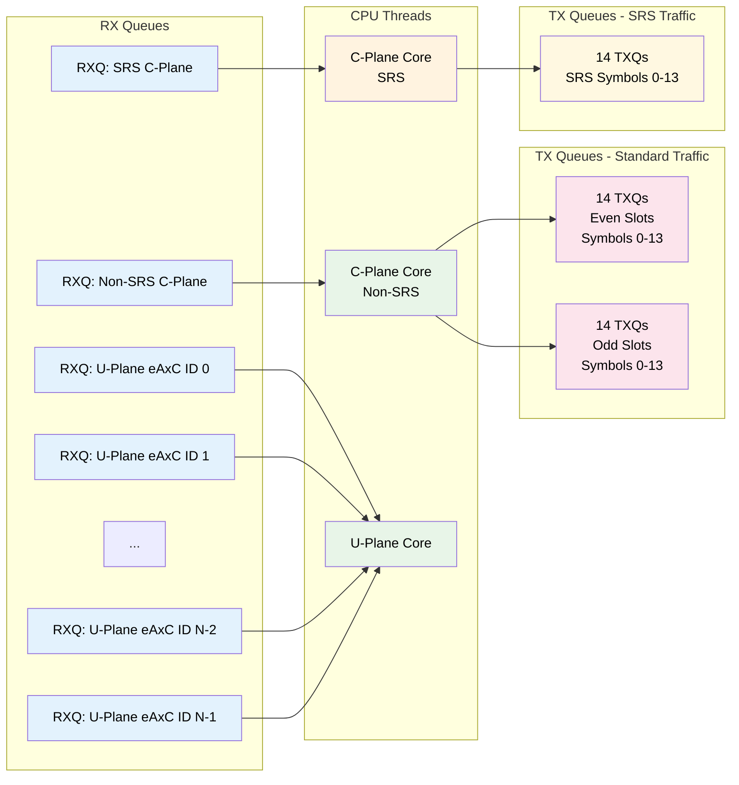

# RU Emulator Module Overview

## Introduction

The RU (Radio Unit) Emulator is a sophisticated software component designed to simulate the behavior of a 5G Radio Unit in a controlled testing environment. Instead of using actual wireless client data, it utilizes static I/Q samples from test vector files to generate realistic network traffic patterns. The emulator is configurable for both TDD (Time Division Duplex) and FDD (Frequency Division Duplex) multicell scenarios.

## Purpose and Use Cases

### Primary Objectives
- **Network Testing**: Simulate RU behavior for comprehensive network testing without requiring actual wireless hardware
- **Protocol Validation**: Validate Control Plane and User Plane message handling in 5G fronthaul networks
- **Performance Analysis**: Measure throughput, latency, and timing characteristics of network components
- **Development Support**: Provide a stable testing environment for DU (Distributed Unit) development

### Key Capabilities
- **Static I/Q Data Processing**: Uses predefined test vectors instead of live wireless data
- **Ethernet Frame Generation**: Converts Control Plane messages into User Plane Ethernet frames
- **Downlink Validation**: Validates received downlink payloads using checksums
- **Throughput Measurement**: Provides detailed throughput analysis and statistics
- **Multicell Support**: Configurable for multiple cell scenarios
- **Timing Analysis**: Comprehensive timing validation and measurement capabilities

## Core Components

### 1. Main Emulator Class (`RU_Emulator`)
The central orchestrator that manages all emulator functionality:
- **Initialization**: Configuration parsing, resource setup, and system initialization
- **Runtime Management**: Slot scheduling, timing control, and packet processing
- **Statistics Collection**: Performance metrics, timing analysis, and throughput measurement

### 2. Network Interface Layer
- **DPDK Integration**: High-performance packet processing using Data Plane Development Kit
- **Mellanox Support**: Optimized for ConnectX-5 100Gbps Ethernet cards
- **Flow Management**: Handles multiple network flows for different channels and cells

### 3. Test Vector Processing (`tv_parser`)
- **HDF5 File Support**: Reads test vector data from HDF5 format files
- **Channel-Specific Parsing**: Handles different channel types (PUSCH, PRACH, PUCCH, SRS, PDSCH, PBCH, PDCCH, CSI-RS)
- **Beamforming Support**: Processes beamforming weights and configurations

### 4. Protocol Handlers
- **Control Plane Processing**: Handles O-RAN C-Plane messages (Section Type 1 and 3)
- **User Plane Processing**: Manages UL U-Plane message transmission and DL U-Plane validation
- **Timing Management**: Ensures proper timing alignment with DU components

## Design Architecture

The RU Emulator follows a sophisticated design that separates Control Plane (C-Plane) and User Plane (U-Plane) processing into dedicated core groups, each optimized for their specific responsibilities.

### FH resources design

#### Aerial FH driver interfacing

RU Emulator is built on top of the Aerial FH driver library. One `Peer` is created per cell with the `HYBRID` type.
```
enum class RxApiMode
{
    FLOW,   //!< Receive data on each flow separately
    PEER,   //!< Simultaneously receive data on all flows associated with a cell
    HYBRID, //!< Receive C-plane per peer and U-plane per flow
    TXONLY, //!< Don't allocate any RXQs
    UEMODE, //!< Allocate CPU RXQs for RX, DOCA TXQs for TX
};
```

Another flag set true for RU is:
```
PeerInfo::share_txqs = true;     //!< Set to true if you want to share txqs among all peers
```
We do this to share the TXQs across cells per symbol. The important underlying assumption is that all cells TX have the same offset, in other words same symbol timeline, to maintain chronological order of enqueue.

NIC resource allocations for the `HYBRID` Peer happens in `void Peer::request_nic_resources()` and `void Flow::request_nic_resources()`.



#### RX Queue allocation

- 3 RXQ per cell
   - 1 non SRS C-Plane
   - 1 SRS C-Plane
   - 1 U-Plane per DL eAxC

- Ethernet flow rules applied on each queue RX Queue
   - non SRS C-Plane
      - SRC/DST MAC address
      - spec type, VLAN
      - eCPRI type: RTC(C-plane)
      - VLAN tag
      - Standard UL/DL eAxC IDs
   - SRS C-Plane
      - SRC/DST MAC address
      - spec type, VLAN
      - eCPRI type: RTC(C-plane)
      - VLAN tag
      - SRS eAxC IDs
   - U-Plane
      - SRC/DST MAC address
      - spec type, VLAN
      - eCPRI type: IQ(U-plane)
      - VLAN tag
      - DL eAxC ID[x]

##### Non-SRS C-Plane Flow Rules
```yaml
flow_rules:
  non_srs_cplane:
    src_mac: "DU_MAC_ADDRESS"
    dst_mac: "RU_MAC_ADDRESS"
    spec_type: "ORAN_SPEC"
    vlan: "CONFIGURED_VLAN"
    ecpri_type: "RTC(C-plane)"
    vlan_tag: "VLAN_ID"
    eaxc_ids: "STANDARD_UL_DL_EAXC_IDS"
```

##### SRS C-Plane Flow Rules
```yaml
flow_rules:
  srs_cplane:
    src_mac: "DU_MAC_ADDRESS"
    dst_mac: "RU_MAC_ADDRESS"
    spec_type: "ORAN_SPEC"
    vlan: "CONFIGURED_VLAN"
    ecpri_type: "RTC(C-plane)"
    vlan_tag: "VLAN_ID"
    eaxc_ids: "SRS_EAXC_IDS"
```

##### U-Plane Flow Rules
```yaml
flow_rules:
  uplane:
    src_mac: "DU_MAC_ADDRESS"
    dst_mac: "RU_MAC_ADDRESS"
    spec_type: "ORAN_SPEC"
    vlan: "CONFIGURED_VLAN"
    ecpri_type: "RTC(C-plane)"
    vlan_tag: "VLAN_ID"
    eaxc_ids: "DL_EAXC_ID[x]"
```

**Flow Rule Benefits:**
- **Traffic Isolation**: Separate queues prevent cross-traffic interference
- **Priority Handling**: Dedicated queues enable priority-based processing
- **Load Balancing**: Efficient distribution of traffic across available resources
- **Debugging Support**: Isolated queues simplify traffic analysis and debugging

##### TX Queue allocation
- 42 TXQ per system
   - 14 TXQ for even slots, 14 TXQ for odd slots
      - 1 TXQ per symbol
   - 14 TXQ for SRS

##### TX Queue Allocation Strategy

**System-wide TX Queue Configuration:**
- **42 TXQs total** for comprehensive symbol-level control:
  - **28 TXQs for standard traffic** (14 for even slots + 14 for odd slots)
    - **1 TXQ per symbol** (14 symbols per slot)
    - **Dual slot sets** to handle slot boundary overlaps
  - **14 TXQs for SRS traffic** (dedicated SRS processing)

**Slot Boundary Handling:**
- **Symbol Overlap Management**: Symbol 13 of slot 0 can overlap with Symbol 0 of slot 1
- **Dual Queue Sets**: Separate even/odd slot queues prevent timing conflicts
- **SRS Isolation**: Dedicated SRS queues handle different timing requirements

##### Accurate Send Scheduling Feature

- Accurate send scheduling feature allows us to schedule packets to be sent into the future. 
- The limitation with this feature is that at the software level, we need to enqueue things in chronological order. 
- Because SRS uses a different time offset, we need to allocate one set of TXQs for SRS traffic independently. 

**Core Functionality:**
- **Future Packet Scheduling**: Enables scheduling packets for transmission at specific future timestamps
- **Hardware-level Timing**: NIC hardware enforces precise transmission timing
- **Chronological Ordering**: Software must enqueue packets in chronological order

**Technical Details:**

**Hardware Queue Processing:**
1. **SW Enqueue**: When we enqueue a packet with TX timestamp, under the hood we enqueue a Wait WQE followed by the packet WQE
2. **Wait WQE Enqueue**: Wait WQEs with designated TX timestamps are enqueued
3. **Traffic Blocking**: NIC blocks all TX traffic until timestamp is reached
4. **Burst Transmission**: NIC sends all packets until next Wait WQE

**SRS Timing Considerations:**
- **Different Time Offsets**: SRS uses different timing offsets compared to standard traffic
- **Independent TXQ Sets**: Separate TXQ allocation prevents timing conflicts
- **Slot Pattern**: SRS typically occurs on slots *3 (3, 13, 23, etc.)

**Limitations and Constraints:**
- **Chronological Ordering**: Software must maintain strict chronological order
- **SRS Separation**: Different timing requirements necessitate separate queue sets

##### Timing Validation and Management
The RU Emulator implements comprehensive timing validation based on configurable parameters:

```yaml
oran_timing_info:
  dl_c_plane_timing_delay: 669      # Downlink C-Plane timing delay (μs)
  dl_c_plane_window_size: 250       # Downlink C-Plane validation window (μs)
  ul_c_plane_timing_delay: 535      # Uplink C-Plane timing delay (μs)
  ul_c_plane_window_size: 250       # Uplink C-Plane validation window (μs)
  dl_u_plane_timing_delay: 345      # Downlink U-Plane timing delay (μs)
  dl_u_plane_window_size: 51        # Downlink U-Plane validation window (μs)
```

**Timing Validation Process:**
- **Early Packet Detection**: Identifies packets arriving before the expected timing window
- **On-Time Validation**: Ensures packets arrive within the specified timing window
- **Late Packet Handling**: Manages packets arriving after the timing window
- **Window-based Analysis**: Uses configurable windows for different packet types

### C-Plane Core Design

#### Multithreading Design
Depending on the number of the C-Plane (ul_core_list) allocated, we assign a list of RXQs that the C-Plane core will try to dequeue from in a round robin fashion. Multiple cores can be given the same RXQ for them to handle the same cell, or multiple queues can be given to the same core to handle multiple cells.

A subset of the UL cores are allocated for SRS processing.

i.e. For 6C mMIMO, on the R750 we allocate 21 UL cores. 18 cores for UL, 3 for SRS
- 3 cores for each cell for non SRS C-plane.
- Each SRS C-plane core handles 2 cells.

The is_srs flag for C-plane determines which queue for the FH receive API to call.
```
void Peer::receive(MsgReceiveInfo* info, size_t* num_msgs, bool srs)
```

#### Downlink C-Plane Processing
1. **Message Reception**: Receives O-RAN C-Plane messages from DU
2. **Resource Allocation**: Processes PRB (Physical Resource Block) assignments
3. **Beamforming Configuration**: Manages beamforming parameters and beam IDs
4. **Timing Coordination**: Ensures proper timing alignment with DU

#### Uplink C-Plane Processing
The Uplink C-Plane cores perform the following key operations:

1. **Test Vector Correlation**: Correlate incoming C-Plane time and frequency ranges against stored test vectors
2.  **Section Processing**: Handles Section Type 1 for non-PRACH and 3 for PRACH messages

2. **U-Plane Packet Preparation**: Prepare U-Plane packets with I/Q samples from test vectors
3. **Timing Offset Management**: Apply configurable transmission offsets:
   - **Standard U-Plane**: `ul_u_plane_tx_offset` μs
   - **SRS U-Plane**: `ul_u_plane_tx_offset_srs` μs
4. **TXQ Enqueueing**: Enqueue prepared packets into transmission queues based on T0 timing + offset

**Processing Flow:**
```
C-Plane Message → TV Correlation → Packet Preparation → Add corresponding IQ samples to Packet → Apply Timing Offset → TXQ Enqueue
```

### C-Plane Handling Optimizations 
- Preallocating mbufs
- sending without freeing requests
- sending symbol by symbol
- multiple cplane_cores for the same cell, or multiple cells on the same cplane_cores
- splitting SRS

### U-Plane Core Design

#### Channel Validation and Processing
U-Plane cores handle comprehensive validation and processing of data packets:

**Payload Validation:**
- **Protocol Compliance**: Ensure O-RAN protocol compliance
- **Channel Type Validation**: Verify correct channel type identification
- **Beamforming Validation**: Validate dynamic beam ID assignments

**Timing Validation:**
- **Arrival Time Analysis**: Monitor packet arrival timing
- **Window-based Validation**: Ensure packets arrive within timing windows

##### Downlink U-Plane Processing
- **Packet Reception**: Receive downlink U-Plane packets
- **Payload Extraction**: Extract I/Q samples and control information
- **Validation**: Perform comprehensive payload and timing validation
- **Statistics Collection**: Gather performance metrics and statistics

##### Uplink U-Plane Processing
- **Packet Generation**: Generate U-Plane packets from test vector data
- **Timing Control**: Apply precise timing for transmission
- **Flow Management**: Manage multiple flows and channels
- **Performance Monitoring**: Track transmission performance log when the CPU falls behind when the designated future TX time of the packet has already passed

## Conclusion

The RU Emulator is a comprehensive testing and validation tool for 5G network components. Its modular architecture, extensive configuration options, and robust validation capabilities make it an essential component for 5G network development and testing. The emulator provides a realistic simulation environment that enables thorough testing of network protocols, performance characteristics, and system integration without requiring actual wireless hardware.

The combination of static test vector processing, real-time network simulation, and comprehensive monitoring capabilities makes the RU Emulator a powerful tool for 5G network development, testing, and validation. 