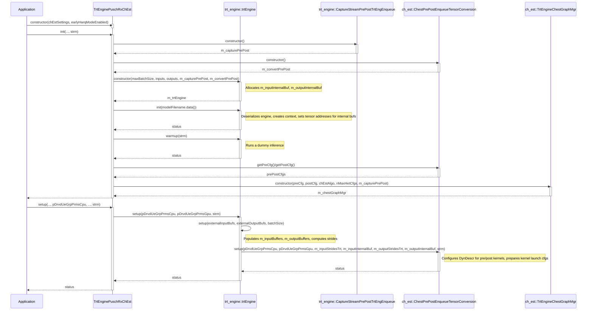

# TensorRT Integration with IModule for Channel Estimation

This document outlines the tensor flow, buffer management, and operational differences between graph and stream modes when integrating TensorRT for channel estimation via the `IModule` interface, specifically focusing on `trtengine_chest.hpp` and its related components.

## Overview

The integration relies on a generic TensorRT engine (`trt_engine.hpp`) and specialized pre/post-processing steps handled by `ChestPrePostEnqueueTensorConversion` (defined in `ch_est_trtengine_pre_post_conversion.hpp` and `.cu`). These steps are crucial for preparing input data for the TensorRT model and processing its output.

Two key CUDA kernels are involved in this pre/post-processing:

1.  **`prepareChestMlInputsKernel`**:
    *   Reads complex-valued data from the Least Squares (LS) channel estimation output (typically `drvdUeGrpPrms.tInfoDmrsLSEst.pAddr`).
    *   Unpacks the complex numbers into their real and imaginary components.
    *   Copies the resulting real-valued data into an internal buffer (`dynDescr.tInputInternalBuf.pAddr`) that the TensorRT engine will consume.

2.  **`extractChestMlOutputsKernel`**:
    *   Reads real-valued data from the TensorRT engine\'s output buffer (`dynDescr.tOutputInternalBuf.pAddr`).
    *   Packs the real and imaginary components back into complex numbers.
    *   Copies the resulting complex-valued data to the final channel estimate output tensor (typically `drvdUeGrpPrms.tInfoHEst.pAddr`).

## Execution Modes

The way these pre/post conversion kernels are invoked differs significantly between graph mode and stream mode.

### Graph Mode (Non-Stream)

In graph mode, the pre/post conversion kernels are integrated as nodes within a larger CUDA graph.

1.  **Graph Construction**:
    *   During the initialization of `TrtEnginePuschRxChEst`, a `TrtEngineChestGraphMgr` is created. This manager, through classes like `TrtEngineChestNodeGraph` or `TrtEngineChestSubSlotNodes`, obtains kernel launch configurations (`puschPrePostTensorConversionLaunchCfg_t`) for the pre and post kernels. These configurations are prepared by `ChestPrePostEnqueueTensorConversion::setup`, which sets the `func` pointer in `kernelNodeParamsDriver` to `prepareChestMlInputsKernel` and `extractChestMlOutputsKernel` respectively.
    *   The `addSecondaryKernelNodeToGraphImpl` function (called by `TrtEngineChestNodeGraph::addSecondaryKernelNodeToGraph` or its sub-slot equivalent) adds three key nodes:
        *   A kernel node for the pre-conversion step (e.g., `m_chEstSecondNodes[0]`).
        *   A child graph node for the TensorRT engine\'s inference (`pCapture->getGraph()`).
        *   A kernel node for the post-conversion step (e.g., `m_chEstSecondNodes[2]`).

2.  **Graph Execution Parameterization**:
    *   When the graph is about to be executed or its parameters updated, `setSecondaryNodeStatusImpl` (called by `TrtEngineChestNodeGraph::setSecondaryNodeStatus` or its sub-slot equivalent) is invoked.
    *   This function uses `cuGraphExecKernelNodeSetParams` to assign the actual `kernelNodeParamsDriver` (containing the function pointers to `prepareChestMlInputsKernel` and `extractChestMlOutputsKernel` and their arguments) to the pre and post-conversion kernel nodes in the executable graph (`CUgraphExec`).

This ensures that the pre-processing, TensorRT inference, and post-processing execute as a sequence of dependent nodes within the CUDA graph.

### Stream Mode

In stream mode, the pre/post conversion kernels are launched as distinct CUDA kernel calls on a stream, bracketing the TensorRT engine\'s execution.

1.  **Invocation Path**:
    *   `TrtEngineChestStream::launchKernels` (or `launchKernels0Slot`) eventually calls `m_trtEngine->run(stream)`.

2.  **`trtEngine::run()` Execution Flow**:
    *   `m_prePostEnqueueTensorConversion->preEnqueueConvert(...)` is called. Since `m_prePostEnqueueTensorConversion` is an instance of `ChestPrePostEnqueueTensorConversion`, this directly launches the `prepareChestMlInputsKernel` on the provided stream.
    *   `m_context->enqueueV3(cuStream)` executes the TensorRT inference.
    *   `m_prePostEnqueueTensorConversion->postEnqueueConvert(...)` is called, which directly launches the `extractChestMlOutputsKernel` on the stream.

## Buffer Management and Data Flow

Understanding the different buffers involved is key to grasping the data flow.

### `trtEngine` Buffers (`trt_engine.hpp`)

*   **`m_inputInternalBuf` / `m_outputInternalBuf`**:
    *   These are device memory buffers allocated and owned by the `trtEngine` instance during its `init()` method.
    *   The TensorRT execution context (`m_context`) is configured to read its inputs directly from `m_inputInternalBuf` and write its outputs directly to `m_outputInternalBuf`.

*   **`m_inputBuffers` / `m_outputBuffers`**:
    *   These are `std::vector<void*>` members within `trtEngine` that store pointers to *external* data buffers.
    *   In the context of `trtengine_chest`, the `trtEngine::setup(...)` overload that takes `gsl_lite::span<cuphyPuschRxUeGrpPrms_t>` populates these:
        *   `m_inputBuffers[0]` is populated with the address of the LS estimate output tensor (e.g., `pDrvdUeGrpPrmsCpu[0].tInfoDmrsLSEst.pAddr`).
        *   `m_outputBuffers[0]` is populated with the address of the final channel estimate tensor (e.g., `pDrvdUeGrpPrmsCpu[0].tInfoHEst.pAddr`).
    *   **Crucial Clarification for `trtengine_chest`**: While `trtEngine` populates `m_inputBuffers` and `m_outputBuffers` and passes them to the `preEnqueueConvert`/`postEnqueueConvert` methods of the `IPrePostEnqueueTensorConversion` interface (which is `ChestPrePostEnqueueTensorConversion` in this case), the *specific implementation* of these conversion methods in `ChestPrePostEnqueueTensorConversion` does **not** directly use these passed-in `inputBuffers`/`outputBuffers` pointers for sourcing data from the LS estimate or sinking data to the final H_est. 
    *   Instead, the `prepareChestMlInputsKernel` and `extractChestMlOutputsKernel` (launched by `ChestPrePostEnqueueTensorConversion`) access the LS output and H_est input/output buffers directly via the `pDrvdUeGrpPrms` pointer within their `puschPrePostTensorConversionDynDescr_t` dynamic descriptor. The `[[maybe_unused]]` attribute on `inputBuffers` and `outputBuffers` in the `ChestPrePostEnqueueTensorConversion` method signatures reflects this.
    *   A more generic `IPrePostEnqueueTensorConversion` implementation (like the default `trt_engine::PrePostEnqueueTensorConversion`) *would* use these `m_inputBuffers`/`m_outputBuffers` for a direct copy to/from `m_inputInternalBuf`/`m_outputInternalBuf`.

### `ChestPrePostEnqueueTensorConversion` Buffers and Data Flow

The `ChestPrePostEnqueueTensorConversion::setup` method receives pointers to `trtEngine`\'s `m_inputInternalBuf` and `m_outputInternalBuf`. It uses these to populate its internal dynamic descriptor (`puschPrePostTensorConversionDynDescr_t`):

*   `dynDescrCpu.tInputInternalBuf.pAddr` points to `trtEngine::m_inputInternalBuf[0]`.
*   `dynDescrCpu.tOutputInternalBuf.pAddr` points to `trtEngine::m_outputInternalBuf[0]`.

The kernels then operate as follows:

**Input Data Flow (LS Output to TRT Engine):**

1.  The LS kernel produces its output (e.g., at `drvdUeGrpPrms.tInfoDmrsLSEst.pAddr`).
2.  `prepareChestMlInputsKernel` reads from `drvdUeGrpPrms.tInfoDmrsLSEst.pAddr`.
3.  It performs complex-to-real conversion.
4.  It **copies** the converted data to `dynDescr.tInputInternalBuf.pAddr` (which is `trtEngine::m_inputInternalBuf[0]`).
5.  The TensorRT engine reads directly from `trtEngine::m_inputInternalBuf[0]`.

**Output Data Flow (TRT Engine to Final H_est):**

1.  The TensorRT engine writes its output directly to `trtEngine::m_outputInternalBuf[0]`.
2.  `extractChestMlOutputsKernel` reads from `dynDescr.tOutputInternalBuf.pAddr` (which is `trtEngine::m_outputInternalBuf[0]`).
3.  It performs real-to-complex conversion.
4.  It **copies** the converted data to the final channel estimate tensor (e.g., `drvdUeGrpPrms.tInfoHEst.pAddr`).

### Necessity of Copy

A data copy into `trtEngine`\'s internal buffers (`m_inputInternalBuf`, `m_outputInternalBuf`) is generally necessary in this design because:

1.  **Memory Ownership**: `trtEngine` allocates and manages its own internal buffers for direct interaction with the TensorRT runtime. These are distinct from the memory locations of external tensors like the LS output.
2.  **Data Format/Layout**: Even if complex conversion wasn\'t needed, the TRT engine might require specific data layouts (striding, contiguity) that the external tensors don\'t guarantee. The pre/post kernels ensure data is in the correct format *and* memory location for TRT.

The `ChestPrePostEnqueueTensorConversion` effectively bridges the external data producers/consumers with the TensorRT engine\'s dedicated I/O buffers through these explicit kernel-mediated copy and conversion steps.

## Initialization and Setup Sequence

The following diagram illustrates the sequence of operations during the `init()` and `setup()` phases of `TrtEnginePuschRxChEst`:

