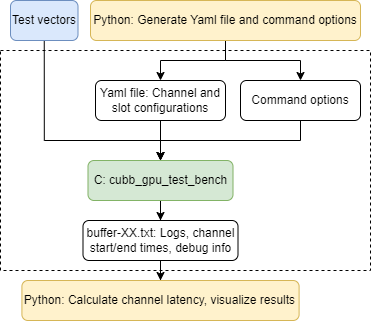

# Aerial SDK TestBenches

## Overview

The `testBenches` directory contains various testing and benchmarking tools for the Aerial SDK components:

```
testBenches/
├── cubb_gpu_test_bench/     # GPU-only performance testbench
├── perf/                    # Python helper scripts for cubb_gpu_test_bench
├── chanModels/              # 3GPP 38.901 channel model
└── phase4_test_scripts/     # cuBB test (CPU+GPU) automation scripts
```

### Components

- **cubb_gpu_test_bench**: GPU-only performance testbench for measuring channel latencies, cell capacity, and GPU memory/power; simplified from the comprehensive cuBB testbench
- **perf**: Python helper scripts for `cubb_gpu_test_bench` to generate configurations, run tests, and visualize results
- **chanModels**: 3GPP 38.901 channel model library including link-level (TDL/CDL) and system-level (UMa/UMi/RMa) models
- **phase4_test_scripts**: Automated scripts for running end-to-end cuBB tests (also called Phase-4 tests in existing documents; see [phase4_test_scripts/README.md](phase4_test_scripts/README.md))

---

# Performance Testing with cubb_gpu_test_bench

## Introduction

`cubb_gpu_test_bench` is a GPU-only testbench that enables multiple channels sharing the same GPU through NVIDIA Multi-Process Service (MPS). It can execute the workloads, measure the latency of each workload over a specific number of time slots, and visualize the latency results. Here latency refers to the execution time of each workload on the GPU as measured by CUDA events. This means that the setup stage and CPU execution is not considered in cubb_gpu_test_bench. Additionally, it can collect Nsight traces for profiling purposes.

The core component is a C platform testbench located at `<aerial_sdk>/testBenches/cubb_gpu_test_bench` that accepts several command options and a yaml file. Please use `cubb_gpu_test_bench -h` to see the available command options. To facilitate the tests, a Python interface `<aerial_sdk>/testBenches/perf` is provided that help generate the command options and yaml file, visualize results, and collect Nsight traces. Using the Python interface is highly recommended for ease of use.



## Requirements

The tests can be run using a Linux environment making one of more GPU available. It's recommended to use the cuBB container since all the following requirements are automatically satisfied. The cuBB container is available on the [NVIDIA GPU Cloud (NGC)](https://registry.ngc.nvidia.com/orgs/qhrjhjrvlsbu/containers/aerial-cuda-accelerated-ran). Follow the instructions on that page to pull the container and to run the container.

If not using the cuBB container, make sure the following requirements are met:

* bash or zsh as default shell
* CUDA toolkit 12.6+ and properly configured so that nvidia-cuda-mps-control and nvidia-smi are in PATH
* Python 3.8+ and the following additional packages
  * numpy, pyCUDA, pyYAML, matplotlib

## Test Vectors (TVs)

A TV is a H5 file that includes the configurations, input data and reference output data for a specific channel. It can be generated using 5GModel of Aerial SDK located in `<aerial_sdk>/5GModel`. Use the following commend in MATLAB to generate the performance TVs to be used for cubb_gpu_test_bench tests

```matlab
runRegression({'TestVector'}, {'perf_TVs'}, {'full'})
```

Wait for the TV generation to finish and copy the TVs to a `<test_vectors>` folder, either inside or outside of `<aerial_sdk>`. Note that each test of cubb_gpu_test_bench only use a subset of TVs. For instance, only the following TVs are required to run the example below of 4T4R 20C:

| Channel | TV File Name                                                     |
| ------- | ---------------------------------------------------------------- |
| PDSCH   | TV_cuphy_V08-DS-02_slot0_MIMO4x4_PRB45_DataSyms12_qam256.h5      |
| PUSCH   | TV_cuphy_U08-US-02_snrdb40.00_MIMO2x4_PRB45_DataSyms13_qam256.h5 |
| PRACH   | TV_cuphy_F08-RA-01.h5                                            |
| PDCCH   | TV_cuphy_F08-DC-40_PRB273.h5                                     |
| PUCCH   | TV_cuphy_F08-UC-RC_PRB273.h5                                     |
| SSB     | TV_cuphy_F08-SS-01.h5                                            |
| CSIRS   | TV_cuphy_F08-CR-01.h5                                            |

`<aerial_sdk>/testBenches/perf/copyCubbGpuTestbenchTv.py` is a sample script to copy the commonly used performance TVs for cell capacity measurement. Please change the `tvSource, tvDestination, tvNames` on L98 and/or L100 as needed.

* If you see the following error, it is mostly likely a TV issue. Please try pull the latest Aerial SDK changes and regenerate the latest TVs.
  ```shell
  terminate called after throwing an instance of 'cuphy::cuphyHDF5_exception' what(): No such scalar or structure field with the given name exists.
  ```

## Building cubb_gpu_test_bench Testbench

The cubb_gpu_test_bench is built as part of the standard Aerial SDK build process. To build the complete Aerial SDK including cubb_gpu_test_bench:

```shell
# Build full Aerial SDK
$cuBB_SDK/testBenches/phase4_test_scripts/build_aerial_sdk.sh
```

Alternatively, you can manually configure the build options:

```shell
# Recommend running from the aerial_sdk root directory
cmake -B<build_dir> -GNinja -DCMAKE_TOOLCHAIN_FILE=cuPHY/cmake/toolchains/native -DCMAKE_BUILD_TYPE=Debug
```

Once configured, you can build all testbench example targets (including cubb_gpu_test_bench and channel models below) using the `testbenches_examples` target:
```shell
# Run from the directory that contains <build_dir>
cmake --build <build_dir> --target testbenches_examples
```

To build a single target, for example `cubb_gpu_test_bench`:
```shell
# Run from the directory that contains <build_dir>
cmake --build <build_dir> --target cubb_gpu_test_bench
```

## Run the Testbench

The main goal of this testbench is to measure the latency of multi-channel, multi-cell workloads. It repeatedly launches a pre-defined pattern on the GPU and measures latency per channel using CUDA events. In this latency measurement mode, channel objects are reset between patterns. Due to workload variation and interactions between multiple channels (e.g., different numbers of SMs assigned per channel over time), latency varies across iterations. This produces CDFs (Cumulative Distribution Functions) of latency for different channels. By comparing these latencies against the budgets, we can determine whether a specific cell count is achievable.

Here we use an example of 4T4R 20C on GH200 to show how to run the tests. Assuming the current directory is `<testBenches>/perf`, there are three steps:

### Step 1: Initial Setup

```shell
python3 generate_avg_TDD.py --peak 4 5 6 7 8 9 10 11 12 13 14 15 16 17 18 19 20 --avg 0 --case F08 --exact --fdm
```

Since we want to run 20C, make sure 20 is included in `--peak`. There should be a JSON file `uc_avg_F08_TDD.json` generated.

### Step 2: Run Tests

```shell
python3 measure.py --cuphy <testBenches>/build --vectors <test_vectors> --config example_100_testcases_avg_F08.json --uc uc_avg_F08_TDD.json --delay 100000 --gpu 0 --freq 1980 --start 20 --cap 20 --iterations 1 --slots 400 --power 900 --target 8 12 8 117 132 12 --2cb_per_sm --save_buffer --priority --prach --prach_isolate --pdcch --pdcch_isolate --pucch --pucch_isolate --tdd_pattern dddsuudddd --pusch_cascaded --ssb --ssb_isolate --csirs --groups_dl --pack_pdsch --groups_pusch --ldpc_parallel --graph
```

Commonly used configs in the above commend are:

* --gpu: GPU ordinal of the GH200 to run tests
* --freq: GPU clock frequency in MHz. cubb_gpu_test_bench will always run under this clock frequency. If the GPU currently has a different clock frequency, the GPU clock frequency will be changed before running tests and restored after running tests.
* --start and --cap: to sweep over a range [--start, --cap] of cell counts.
* --slots: number of slots to be run. Typically use 8 or 16 for debugging, 120 for quick latency test, and 400 for cell capacity measurement.
* --power: GPU power limit to run. Similar to --freq, if different from the current GPU power limit, it will be changed and restored.
* --target: number of SMs for each subcontext. This has a significant impact on performance and requires manual efforts to optimize.
* --graph: enable graph mode. If omitted, stream mode will be used. Using graph mode to run the tests typically leads to a lower latency.

When running the above commend, you should see the detected GPU platform, number of cells, SM allocations. For instance, output from 20 peak cell runs on GH200 with SM allocation 8 12 8 117 132 12:

```shell
Auto detect GPU enabled: GH200 detected, running on NVIDIA GH200 480GB
Number of active cells: 20+0(8,12,8,117,132,12)
```

Wait for the run to finish. There should be three files generated:

* `vectors-20.yaml`: the yaml file used as input to C platform testbench.
* `buffer-20.txt`: all printout message from C platform testbench
* `008_012_008_117_132_012_sweep_graphs_avg_F08.json`: cubb_gpu_test_bench results with three fields

  * `testConfig` : copy of python3 input options, GPU platform, and SM allocation used in cubb_gpu_test_bench tests. Note that SM allocation is capped by the total number of SMs on GPU, i.e., (SM allocation) = min (maxSmCount, --target). A warning will be given if a target parameter is capped by maxSmCount. Actual SM allocation used in running the pattern is saved under `testConfig['smAllocation']`.
  * `20+00`:
    * latencies for each channel
    * `memoryUseMB`: GPU memory used for each channel object, DL and UL
    * `ontimePercent`: On time percentage of each channel. 1.0 means 100%. See Auto detect cell capacity below.

*Auto detect cell capacity*: For TDD long pattern dddsuudddd and F08, F09, F14, the scripts can auto detect cell capacity without drawing the CDF. It checks the on time percentage of all channels and a PASS means 100 % on time percentage. The on time percentages will also be saved in the results JSON file under ontimePercent of each cell setting. Further, there are three types of printout messages:

* If all tested cell settings pass: *Warning: max cell count `<maxCellTested>` passed based on `<nSlots>` slots run, unknown cell capacity (100% on time for all channels), please try larger cell counts*
* If all tested cell settings fail: *Warning: no cell count passed based on `<nSlots>` slots run, unknown cell capacity (100% on time for all channels), please try smaller cell counts*
* Otherwise, the highest cell count passes will be the cell capacity: *Cell capacity is `<cellCapacity>` based on `<nSlots>` slots run (100% on time for all channels)*

### Step 3: Visualization

```shell
python3 compare.py --filename 008_012_008_117_132_012_sweep_graphs_avg_F08.json --cells 20+0
```

There should be a `compare-YYYY_MM_DD.png` file generated where `YYYY_MM_DD` is the date. This figure draws the CDF of the latency results per channel.

To compare the CDF of different runs, e.g., multiple cell counts, two commits before and after CUDA optimizations, CDFs running on different GPU platforms, use `python3 compare.py --filename <json file 1> <json file 2> ... --cells <cell count 1>+0 <cell count 2>+0 ...` . If the `<json file *>` contains folder information, the immediate parent folder will be displayed in the legend.

### Other Usages

#### Collect Nsight Systems Traces

Add `--debug --debug_mode nsys` to the `python3 measure.py ...` command above. It's recommended to use a small number of slots (8 or 16) when collecting traces. By default, it will include CUDA graph node information. Use `--debug --debug_mode nsys_simple` to omit the details inside each graph.

#### GPU Power and Memory Measurement

**Quick GPU status check**: Run `nvidia-smi dmon` in a separate terminal to monitor GPU status in real-time.

**Detailed power and memory measurement**: The Python interface supports GPU power and memory measurement using the `--measure_power` option. It queries GPU status every 10 ms during the test (both setup and run phases). A JSON file will be generated if the test runs successfully. 

Power and memory measurement support both stream and graph modes. Unlike the latency measurement mode above, power measurement requires keeping the GPU continuously busy running patterns without gaps. To achieve this, modify the test parameters to `--delay 0 --slots 8 --iterations 1000` and add `--measure_power`. This keeps the workload running continuously to maintain consistent GPU utilization. 

Example for 4T4R 8 peak cells:

```shell
python3 measure.py --cuphy <testBenches>/build --vectors <test_vectors> --config example_100_testcases_avg_F08.json --uc uc_avg_F08_TDD.json --delay 0 --gpu 0 --freq 1410 --start 8 --cap 8 --iterations 1000 --slots 8 --power 300 --target 8 16 16 92 108 16 --2cb_per_sm --save_buffer --priority --prach --prach_isolate --pdcch --pdcch_isolate --pucch --pucch_isolate --tdd_pattern dddsuudddd --pusch_cascaded --ssb --ssb_isolate --csirs --groups_dl --pack_pdsch --groups_pusch --ldpc_parallel --graph --measure_power
```

**Analyze power consumption**:

```shell
python3 power.py --filename 008_016_016_092_108_016_power_graphs_avg_F08.json --cells 8+0
```

This command displays power measurements and generates a plot of GPU power consumption over time. The maximum GPU power will be output to the command line. Ensure the GPU frequency is locked during measurement.

**Analyze memory consumption**:

```shell
python3 memory_plot.py --filename 008_016_016_092_108_016_power_graphs_avg_F08.json --cells 8+0
```

This command displays the maximum GPU memory usage and generates a plot of GPU memory consumption over time. The peak GPU memory consumption will be output to the command line.

#### Running the C Platform Testbench Natively

To run the C platform testbench natively (e.g., for debugging purposes), add `--test` to the `python3 measure.py ...` command above. This displays the command options and YAML file for the testbench without running the tests. You can then run the C platform testbench directly using the displayed command options and YAML file. Note that running the testbench natively requires manually starting the MPS server.

---

# Channel Models

The `chanModels` directory contains 3GPP 38.901 channel model implementations for wireless propagation simulation, including link-level (TDL/CDL) and system-level (UMa/UMi/RMa) models. It provides a library and unit test examples. These channel models are used by cuPHY and cuMAC for simulation.

## Channel Model Types

### System Level Channel Model
- **Location**: `chanModels/src/sls_chan_src/`
- **Functionality**: 3GPP TR 38.901 statistical channel model implementation
  - Supports UMa, UMi, and RMa
  - GPU-accelerated computation with CUDA kernels and a CPU-only mode if GPU is not available
  - Configurable via YAML files
- **Example**: `chanModels/examples/sls_chan/` - Demo application with H5 output support
- Currently, only 6 GHz - UMa is calibrated with 3GPP reference curves. Calibration of other scenarios will be added later

### Link Level Channel Model
#### Tapped Delay Line (TDL) Channel Model
- **Location**: `chanModels/src/tdl_chan_src/`
- **Functionality**: 3GPP TDL channel model (TDL-A, TDL-B, TDL-C profiles)
  - Simplified delay profile models for link-level simulation
  - Fast fading with configurable Doppler effects
- **Example**: `chanModels/examples/tdl_chan/`
- Calibrated with MATLAB 5G toolbox and our own implementation inside `<aerial_sdk>/5GModel/nr_matlab/channel/genTDL.m`

#### Clustered Delay Line (CDL) Channel Model
- **Location**: `chanModels/src/cdl_chan_src/`
- **Functionality**: 3GPP CDL channel model (CDL-A through CDL-E profiles)
  - Cluster-based multipath propagation
  - Support for both LOS and NLOS scenarios
- **Example**: `chanModels/examples/cdl_chan/`
- Calibrated with MATLAB 5G toolbox and our own implementation inside `<aerial_sdk>/5GModel/nr_matlab/channel/genCDL.m`

## Additional Components

- **OFDM Modulator/Demodulator**: `chanModels/src/ofdm_src/` - OFDM Time-frequency domain conversion
- **Gaussian Noise Adder**: `chanModels/src/gauNoiseAdder.*` - AWGN channel implementation
- **Fading Channel**: `chanModels/src/fading_chan.*` - Generic fading channel implementation that includes OFDM modulation + fast fading + add noise + OFDM demodulation
- **Analysis Tools**: `chanModels/util/` - Python scripts for channel statistics analysis and visualization with H5 dumped from `sls_chan_ex`

## Building and Running Channel Model Examples

Channel model examples are built as part of the standard Aerial SDK build process. To build the complete Aerial SDK including cubb_gpu_test_bench:

```shell
# Build full Aerial SDK
$cuBB_SDK/testBenches/phase4_test_scripts/build_aerial_sdk.sh
```

Alternatively, you can manually configure the build options:

```shell
# Recommend running from the aerial_sdk root directory
cmake -B<build_dir> -GNinja -DCMAKE_TOOLCHAIN_FILE=cuPHY/cmake/toolchains/native -DCMAKE_BUILD_TYPE=Debug
```

Once configured, you can build all testbench example targets (including cubb_gpu_test_bench above and channel models) using the `testbenches_examples` target:
```shell
# Run from the directory that contains <build_dir>
cmake --build <build_dir> --target testbenches_examples
```

To build a single target of channel models, use the following commands:

```shell
# Or build specific examples
cmake --build <build_dir> --target sls_chan_ex
cmake --build <build_dir> --target tdl_chan_ex
cmake --build <build_dir> --target cdl_chan_ex
```

Usage instructions for each example can be found by running:
```shell
<example_executable> -h
```

# Phase-4 Test Scripts (cuBB Tests)

The `phase4_test_scripts` directory contains automated scripts for running end-to-end cuBB tests (also called Phase-4 tests in existing documents) with DU and RU emulators.

These scripts help automate:
- Test configuration from test case strings
- Building Aerial SDK with proper presets
- Setting up DU and RU environments
- Running multi-component tests (RU emulator, cuPHYcontroller, testMAC)
- Multi-L2 test scenarios

**For detailed usage instructions**, see [phase4_test_scripts/README.md](phase4_test_scripts/README.md).
